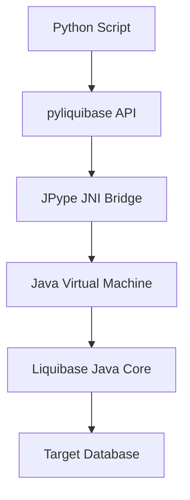

# pyliquibase

A Python module to use [Liquibase](http://www.liquibase.org/) in Python, using the Java Native Interface (JNI).

pyliquibase allows you to execute Liquibase commands directly from your Python scripts or via the command line, providing a seamless integration between Python and Liquibase's powerful database schema evolution capabilities.

## Key Features

- **CLI Support**: Run Liquibase commands directly from your terminal.
- **Python API**: Integrate Liquibase into your Python applications with a simple and intuitive API.
- **JNI Integration**: Uses JPype to bridge Python and Java, ensuring high performance and compatibility.
- **Database Agnostic**: Works with any database supported by Liquibase.

## Python Java Integration

This library leverages [JPype1](https://github.com/jpype-project/jpype) to interact with the Java `LiquibaseCommandLine` class. It starts a Java Virtual Machine (JVM) and passes Liquibase calls to the Java execution engine.

